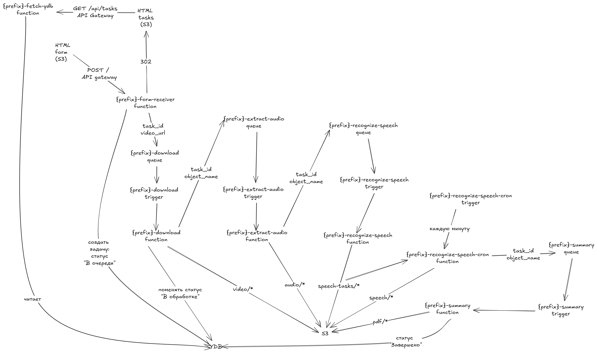

# vvot_hw2

Приложение для генерации PDF конспекта лекции по видео из Яндекс.Диск

## Архитектура


## Использованные ресурсы
- Yandex API Gateway
- Yandex Object Storage
- Yandex Managed Service for YDB.
- Yandex Message Queue
- Yandex Cloud Functions
- Yandex Identity and Access Management
- Yandex Resource Manager
- Yandex SpeechKit
- YandexGPT API

## Запуск
Необходим статически собранный `ffmpeg` по пути `src/extract-audio`.
Например, `ffmpeg-linux-x64` [отсюда](https://github.com/eugeneware/ffmpeg-static/releases). 
Затем сделать его исполняемым:
```bash
chmod +x ./src/extract-audio/ffmpeg
```

Запуск:
```bash
export YC_TOKEN=$(yc iam create-token)

cd terraform
terraform init
terraform apply \
  -var="cloud_id=<ваш_cloud_id>" \
  -var="folder_id=<ваш_folder_id>" \
  -var="prefix=<префикс_для_названий_ресурсов>"
```
